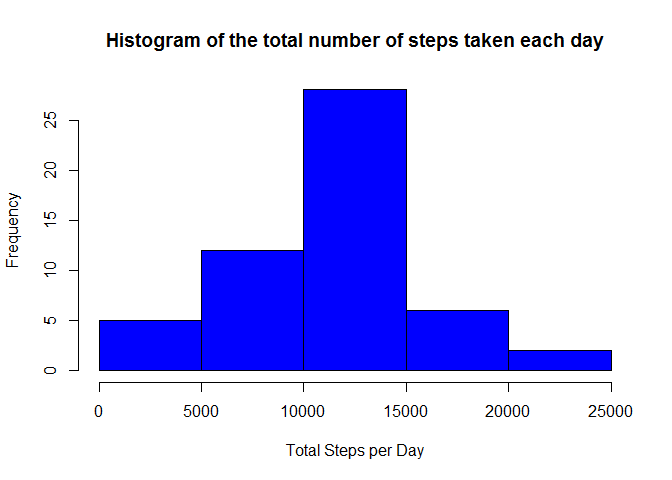
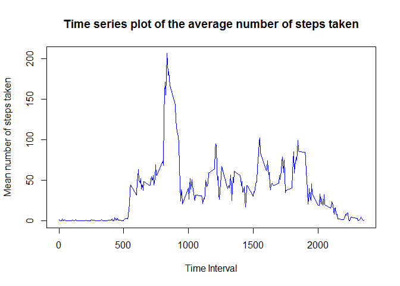
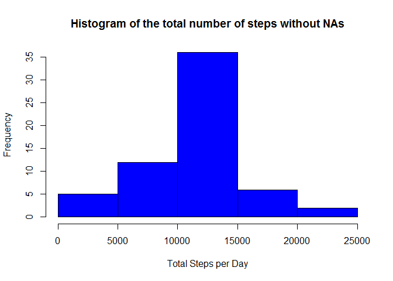

# Reproducible Research: Peer Assessment 1

## 1. Code for reading in the dataset and/or processing the data

```r
unzip("activity.zip")

data <- read.csv("activity.csv")
```

## 2. Histogram of the total number of steps taken each day

```r
data$date <- as.Date(data$date, "%Y-%m-%d")

stepsTotal <- tapply(data$steps, data$date, sum)
hist(stepsTotal, col="blue", xlab = "Total Steps per Day", ylab = "Frequency", 
      main = "Histogram of the total number of steps taken each day")
```

<!-- -->

## 3. Mean and median number of steps taken each day

```r
mean(stepsTotal, na.rm = TRUE)
```

```
## [1] 10766.19
```

```r
median(stepsTotal, na.rm = TRUE)
```

```
## [1] 10765
```

## 4. Time series plot of the average number of steps taken

```r
stepsMean <- tapply(data$steps, data$interval, mean, na.rm = TRUE)

plot(col="blue", row.names(stepsMean), stepsMean, type="l",
     xlab="Time Interval", ylab="Mean number of steps taken", 
     main="Time series plot of the average number of steps taken")
```

<!-- -->

## 5. The 5-minute interval that, on average, contains the maximum number of steps

```r
intervalStepsMax <- names(which.max(stepsMean))
intervalStepsMax
```

```
## [1] "835"
```

## 6. Code to describe and show a strategy for inputing missing data

```r
naIndices <-  which(is.na(data))

values <- stepsMean[as.character(data[naIndices, 3])]
names(values) <- naIndices

for (i in naIndices) {
    data$steps[i] = values[as.character(i)]
}

stepsTotal <- tapply(data$steps, data$date, sum)
```

## 7. Histogram of the total number of steps taken each day after missing values are imputed

```r
hist(stepsTotal, col = "blue", xlab = "Total Steps per Day", 
      ylab = "Frequency", main = "Histogram of the total number of steps without NAs")
```

<!-- -->

## 8. Panel plot comparing the average number of steps taken per 5-minute interval across weekdays and weekends


```r
days <- weekdays(data$date)

data$dayKind <- ifelse(days == "Saturday" | days == "Sunday", "Weekend", "Weekday")

stepsDays <- aggregate(data$steps, by = list(data$interval, data$dayKind), mean)

names(stepsDays) <- c("interval", "dayKind", "steps")

library(lattice)
xyplot(steps ~ interval | dayKind, stepsDays, type = "l", layout = c(1,2), 
        xlab = "Interval", ylab = "Number of steps")
```

<!-- -->
